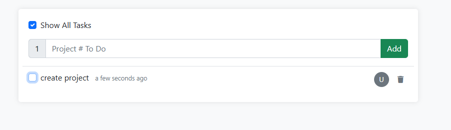

<<<<<<< HEAD
# 📝 Todo List Web App

A simple, clean, and interactive **Todo List** application built using **Laravel**, **Bootstrap 5**, **jQuery**, and **AJAX**. It allows users to add, complete, and delete tasks dynamically with a real-time user interface experience.

---

## 🔥 Features

- ✅ Add tasks dynamically with AJAX
- ✅ Mark tasks as complete/incomplete
- ✅ Toggle visibility of completed tasks
- ✅ Delete tasks with confirmation modal
- ✅ Responsive and clean UI with Bootstrap
- ✅ Real-time task count

---

## 🛠️ Tech Stack

- **Backend**: Laravel 9+
- **Frontend**: Bootstrap 5, jQuery, AJAX
- **Templating**: Blade
- **Database**: MySQL or SQLite (based on your `.env`)
- **Icons**: Font Awesome 6

---

---

## 🚀 Getting Started

Follow these steps to get a local copy up and running.

### Prerequisites

- PHP 8.x
- Composer
- MySQL or SQLite
- Node.js & npm (for Laravel Mix if used)
###Screenshots
### Screenshot 1

### Screenshot 2

### Screenshot 3

### Screenshot 4

